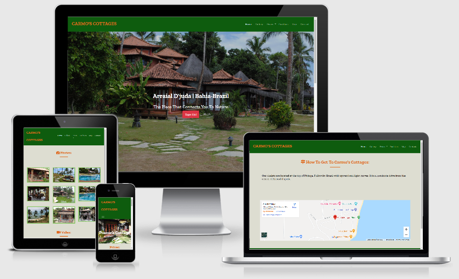
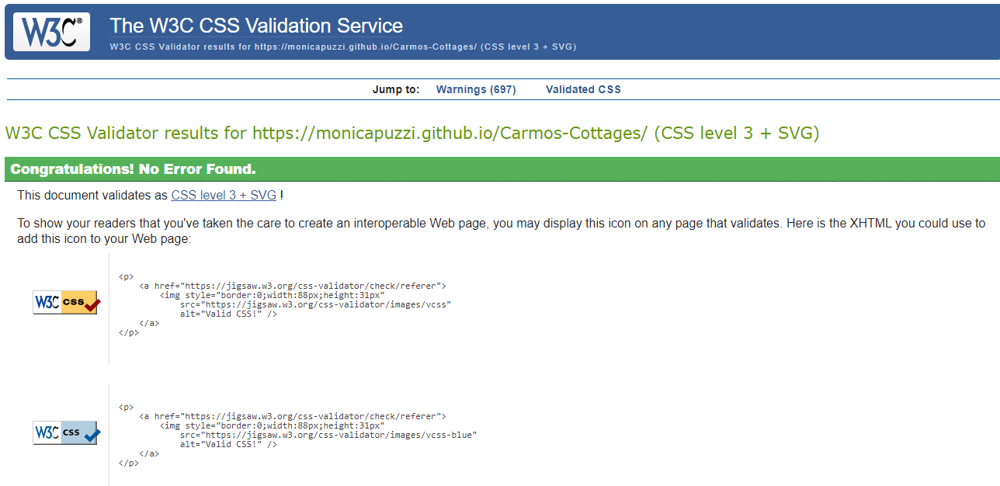
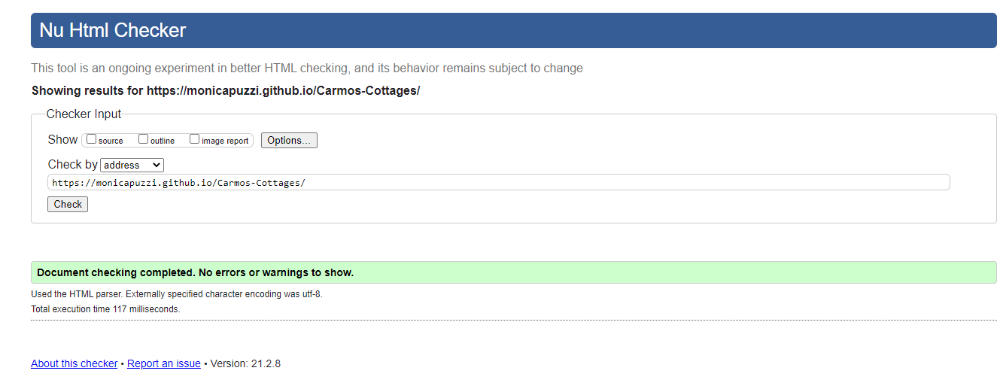
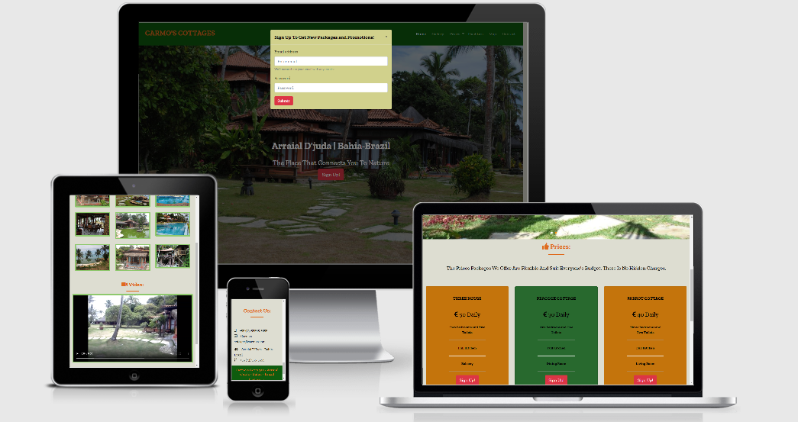
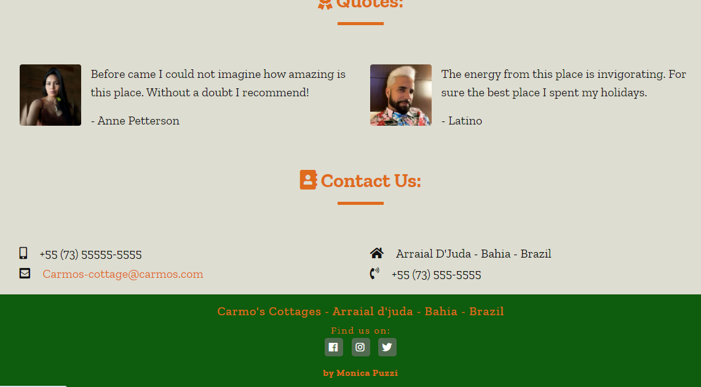

# **Milestone Project 1 - Code Institute** 

# **Carmo's Cottage**

This is a site for European, American and world countries to get to know and enjoy a cosy place with nature that is located in the Northeast of Brazil, Arraial d'juda - Bahia.

The main objective of this website is to allow people from all over the world to know a little more about Brazil, our beautiful beaches, nature and culture.

**Carmo's Cottages** is a **Milestone Project 1** educational project for the Full-Stack Software Developer program developed by the **Code Institute**.

 

## User Experience (UX)
 
**First Time Visitor Goals**: 
- I want to easily navigate the site. 
- I want to find content quickly without getting lost.
- I want to be able to access the site from different devices.

**Returning Visitor Goals**: 
- I want to find the most important information with a touch. 
- I want to be able to contact the owner of the site with agility. 
- I want to be able to access photos and videos of the place.

**Frequent User Goals**: 
- I want to check new photos and videos on the site.
- I want to have a place to subscribe and receive updates on prices and promotional packages.

**Design**

The design was done in basic colours of:
- Orange rgb (223, 107, 29);
- Green rgb (14, 92, 14); 
- Gray rgb (221, 221, 209);
- White;
- Black rgb (19, 18, 18).

**Wireframe**

- [Home Page Wireframe](https://github.com/monicapuzzi/Carmos-Cottages/blob/master/assets/documentation/mockup.jpeg)

**Typography**

Two sources were used for this first project:
- [Zilla Slab](https://fonts.google.com/specimen/Zilla+Slab?preview.text_type=custom) - was used as a general source.
- serif - as a background source.

**Images/Video**

1. When loading the page you will first find the image of the main house of the place, decorated with a Balinese theme.
2. All photos of the place are my property;
3. The Viode is also my property;
4. The two pictures of people were taken from google images;
5. All images were resized and compressed to increase the flow of user experience.

**Iconography**

- Icons were used throughout the site to improve the efficiency of UX.

## Features 

- Main page with scrolling to sections.
- Top menu, which shows four pages (Home, Gallery, Prices, Map) and sections (Facilities and contact).
- Menu with icons with intuitive design for the visually impaired.
- Icons in all sections for styling.
- Icons for contacts and links.
- Image on the main page with a scrolling effect and a form for updates by mail.
- Fully responsive design.
- Social media links always visible in the footer of all pages.
- On the main page, reason section.
- On the main page quotes section with static photos from the people.
- On the main page, contact section.
- On the Gallery page with photos and videos, responsive. Photos open on separate pages when clicked.
- Footer with credits and social media links.
- Cottage price page, which opens with an intuitive dropdown menu.
- On Price page clicking on the cottage name takes you to the page with photos on the carrousel and below cards with prices and button for booking form.
- On the Price page there is a facilities section.
- Map page with live map image.

**Features Left to implement** 
- Option to switch to the Portuguese Language.
- Implement online payment system.
- Implement way of making online reservation of Cottages.
********************************
## Technologies Used

- [HTML 5](https://en.wikipedia.org/wiki/HTML5)
    - The project uses **HTML 5** as the primary language used for the creation of this website.

- [CSS3](https://www.w3schools.com/css/default.asp)
    - The project uses **CSS3** for styling elements throughout the site.

- [Javascript](https://developer.mozilla.org/pt-BR/docs/Web/JavaScript)
   - The project uses **Javascript** by Bootstrap for the modals and carousel.
********************************
## Frameworks, Libraries & Programs Used

- [Bootstrap 4.1](https://getbootstrap.com/docs/4.1/getting-started/introduction/)
   - The project uses **Bootstrap 4.1** throughout the project for website agility, use the navigation bar.

- [Font Awesome](https://fontawesome.com/)
     - The project uses **Font Awesome** to create social media and share icons.

- [Jquery](https://code.jquery.com/jquery-3.3.1.slim.min.js)
   - The project uses **JQuery** used with Bootstrap to make the site responsive and use modals.

- [Google Fonts](https://fonts.google.com/)
   - The project uses **Google Fonts** to import 'Zilla Slab' and placed in the Style CSS to be used throughout the site.

- [Balsamiq](https://balsamiq.com/)
   - The project uses **Balsamiq** to create initial wireframes of the site.

- [Git](https://git-scm.com/)
   - The project uses **Git** for version control by using the Gitpod terminal to commit to Git and Push to GitHub.

- [GitHub](https://github.com/)
    - The project uses **GitHub** to place the code of the project after being pushed from Git.

- [Gitpod](https://www.gitpod.io/)
   - The project uses **Gitpod** for development of the site.

- [Lighthouse](https://developers.google.com/web/tools/lighthouse)
   - The project uses **Lighthouse** for testing performance, accessibility of the site.

## Testing

The W3C Markup Validator and the W3C CSS Validator were used to test and validate all pages of the project to ensure that there were no errors.

 - **Valid CSS**

- **Valid HTML**

All of the pages were tested and validated to ensure the perfect functioning of the project / website.

**How to do the CSS test**

1. First enter the site: [CSS Validator](https://jigsaw.w3.org/css-validator/)
2. You can choose to test and validate by:
    - URL
    - File Upload
    - Direct Input

This site was validated by URL, copied the address of my [Github](https://github.com/monicapuzzi/Carmos-Cottages/settings) site and pasted it in the address after clicking on check. So it will appear if the site has any problems or not. If it does not have this validity, it means that it is working perfectly without errors.

**How to do the HTML test**

1. First enter the site: [HTML Validator](https://validator.w3.org/nu/)
2. You can choose to test and validate by:
    - Address
    - File Upload
    - Text Input

This site was validated by Address, copied the address of my [Github](https://github.com/monicapuzzi/Carmos-Cottages/settings) site and pasted it in the address after clicking on check. So it will appear if the site has any problems or not. If it does not have this validity, it means that it is working perfectly without errors.

**Testing User Stories from User Experience (UX)**

- The site has all the necessary sections to facilitate the user's navigation, the structure was well designed for better user ability, the site guides each section with prowess and expertise. 
- All navigation links have been tested to ensure better development.

- The site is fully responsive on desktops, tablets and mobile devices and has been tested with: MotoG4, Galaxy S5, Pixel 2, Pixel 2 XL, Iphone 5 / SE, Iphone 6,7,8, 8 Plus, X, Ipad, Ipad Pro , Surface Duo and Galaxy Fold, Tablet, Laptop L, 4K.

- There are photos that can be opened on separate pages. It has a video that is played loudly with the volume on the mute, but it has buttons that can stop playback, start again, volume and mute control, it also has the possibility of enlarging it to full screen, downloading the video and the possibility of taking pictures of images from the video. Which is highly responsive on all devices.

 

- There is a "Contact Us" section located at the end of the main page and in the menu, with email address, contact numbers for landline and cell phones and WhatsApp. Clicking on the email address or phones, you are immediately directed to the email box or dialing the phone or WhatsApp.

- All social media links are housed in the footer and have been tested.

- **You can find the site working here: [Demo](https://monicapuzzi.github.io/Carmos-Cottages/)**

**LightHouse**

- Lighthouse is a Google Chrome web development tool, which was used on the site to test its performance, performance, accessibility. 
- Each individual page was tested for desktop and mobile and received a good score in performance, accessibility, best practices and SEO.

**Bugs**

- No bugs.

## Deployment 

- Navigate to the GitHub repository: [Carmo's Cottages](https://github.com/monicapuzzi/Carmos-Cottages)
- Click on the 'Settings' tab.
- Scroll to the Hub Git page header.
- Select 'Master Branch'.
- Click the Save button.
- Click on the link to go to the live page.

**Fork of the GitHub Repository**

- Log in to your GitHub account and find the Github Repository
- In the upper right corner go to "Configuration", click on the "Fork" button.
- The Repository will be added to your Repositories section.

## Credits

**Slack Group**

The Slack Group was helpful in this project.

**Content**

- All the content was written by developer Monica Puzzi.
- All photos and videos of the property are owned by developer Monica Puzzi and have been authorized by the owner of the Cottages

**Acknowledgements**

- My mentor, [Aaron Sinnott](https://github.com/aaronsnig501) for the great feedback.

